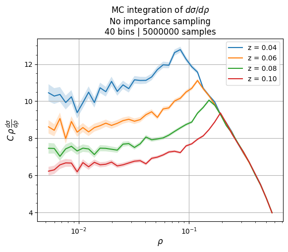

# Project Log -- Fall 2020

## Table of Contents

* [Head](../../)

**Fall 2020**
* September
  * [17 Sep -- 23 Sep](#16-sep----22-sep)
  * [24 Sep -- 1 Oct](#23-sep----1-oct)
  
### 17 Sep -- 23 Sep
[Back to top](#table-of-contents)

* Started reproducing calculation from section 2 of [arXiv: 2006.14680](https://arxiv.org/abs/2006.14680)

  Had trouble with the phase space kinematics. Also ran into issues handling the min and max inside the Heaviside functions of Eq 2.7
  
  
### 24 Sep -- 1 Oct
[Back to top](#table-of-contents)

* #### Finished reproducing the calculation of arXiv: 2006.14680
  
  Solution to my problems: partitioning of unity. Let `H` be Heaviside theta. Then, in an integral, `1 = H(x1 - x2)H(x2 - x3) + H(x1 - x3)H(x3 - x2) + ...` 
  where the sum is over all possible permutations of `x1, x2, x2`.

* #### Implemented a basic Monte Carlo integrator for Eq 2.7

  This is challenging because (a) we must deal with a Dirac delta function and Heaviside theta functions and (b) the integrand diverges as `x1, x2 -> infinity`. 
  The solution is to perform a weighted MC integration as follows:
  
  1) Bin in `rho` (the variable of interest assigned by the delta function)
  2) Generate a bunch of random points `(x1, x2)` (like normal MC)
  3) The delta function tells us which bin to fill with each pair `(x1, x2)`
  4) The theta functions tells us whether to fill the bin
  5) The rest of the integrand tells us which weight to place in the bin
  
  Right now, I am not doing any importance sampling while generating `x1, x2` --- this makes the code very inefficient, as the majority of points generated are
  outside the region of interest `0 < rho < 1`.
  
  
  
* #### Started playing with limiting cases of Eq 2.7
